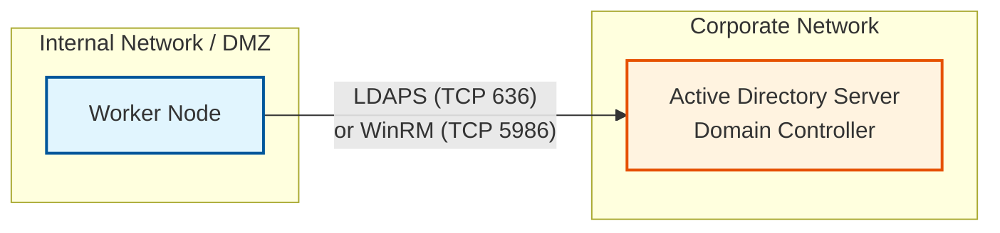
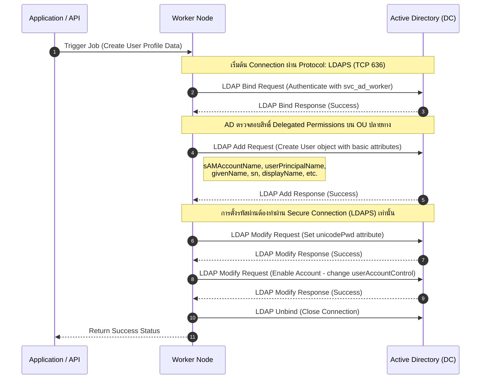

# Active Directory Integration Workflow

เอกสารนี้อธิบายสถาปัตยกรรมและขั้นตอนการทำงาน (Workflow) ระหว่าง Worker และ Active Directory (AD) Server ในการสร้างบัญชีผู้ใช้งาน (Create User) อย่างละเอียด

## 1. Architecture Diagram

สถาปัตยกรรมแสดงการเชื่อมต่อระหว่าง Worker (ระบบที่รับคำสั่งสร้าง User) และ Active Directory Server

### รายละเอียดการสื่อสาร (Communication Protocol)
- **Protocol หลัก:** แนะนำให้ใช้ **LDAPS (LDAP over SSL - TCP Port 636)** เพื่อความปลอดภัย เนื่องจากกระบวนการสร้าง User และการตั้งรหัสผ่าน (`unicodePwd`) บังคับให้ต้องทำการเข้ารหัสข้อมูลผ่าน SSL/TLS เท่านั้น
- **ทางเลือกอื่น:** หาก Worker ใช้ PowerShell ในการทำงาน อาจใช้ **WinRM over HTTPS (TCP Port 5986)** หรือสื่อสารผ่าน Active Directory Module ด้วย RPC/DCOM

## 2. การจัดการสิทธิ์ (Permissions & Delegation)

ในการสร้าง User บน Active Directory อย่างปลอดภัย **ไม่ควร** ใช้สิทธิ์ระดับ Domain Admin แต่ควรใช้วิธี **Delegation of Control** โดยมีรายละเอียดดังนี้:

1. **Service Account:** สร้าง User Account พิเศษสำหรับ Worker โดยเฉพาะ (เช่น `svc_ad_worker`) และกำหนดรหัสผ่านแบบไม่มีวันหมดอายุ (Password never expires)
2. **Target OU (Organizational Unit):** กำหนด OU ปลายทางที่จะให้ Worker นำ User ใหม่ไปวาง (เช่น `OU=Users,OU=Company,DC=domain,DC=local`)
3. **Delegated Permissions:** ผู้ดูแลระบบ AD ต้องทำการ Delegate Control ให้กับ Service Account ที่ OU เป้าหมาย โดยให้สิทธิ์ดังนี้:
   - สิทธิ์ **Create, delete, and manage user accounts** 
   - สิทธิ์ **Reset user passwords and force password change at next logon**
   - สิทธิ์ **Read and write user information** (เพื่อแก้ไข Attributes ต่างๆ เช่น Department, Title, Manager)

## 3. Sequence Workflow Diagram

ขั้นตอนการทำงานตั้งแต่ Worker ได้รับคำสั่งจนถึงการสร้าง User บน AD สำเร็จ

### คำอธิบาย Sequence Diagram อย่างละเอียด
1. **Trigger Job:** ระบบต้นทาง (เช่น HR System หรือ Web Portal) ส่งข้อมูลพนักงานใหม่มาให้ Worker
2. **Bind Request:** Worker ทำการเปิด Connection ไปยัง AD Server ผ่าน LDAPS โดยยืนยันตัวตนด้วย Service Account (`svc_ad_worker`)
3. **Bind Response:** AD ตอบกลับว่าการยืนยันตัวตนสำเร็จ
4. **Add Request:** Worker ส่งคำสั่งสร้าง Object ประเภท User ไปยัง OU ที่กำหนด พร้อมแนบ Attributes พื้นฐานที่จำเป็น (เมื่อสร้างเสร็จสถานะของ User จะถูก Disable ไว้และยังไม่มีรหัสผ่านตามค่าเริ่มต้นของ AD)
5. **Add Response:** AD สร้าง Object ยืนยันว่าสำเร็จ (และได้ตรวจสอบสิทธิ์การเขียนใน OU แล้ว)
6. **Set Password Request:** Worker ส่งคำสั่ง Modify เพื่อแก้ไข Attribute `unicodePwd` (ตั้งรหัสผ่านชั่วคราว)
7. **Set Password Response:** AD ยืนยันการตั้งรหัสผ่านสำเร็จ 
8. **Enable Account Request:** Worker ส่งคำสั่ง Modify แก้ไข Attribute `userAccountControl` (เช่น เปลี่ยนเป็นค่า `512` หมายถึง Normal Account) เพื่อทำการ Enable บัญชีผู้ใช้งาน
9. **Enable Account Response:** AD ยืนยันการเปิดใช้งานบัญชีสำเร็จ
10. **Unbind:** Worker ทำการปิด Connection กับทาง AD Server อย่างสมบูรณ์
11. **Return Status:** Worker ส่งสถานะการประมวลผล (Success) กลับไปยังระบบต้นทาง
