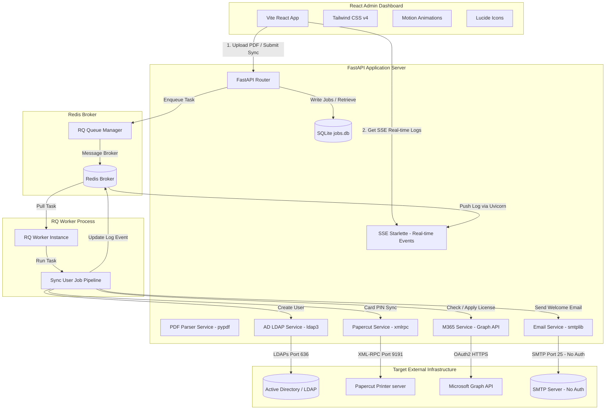
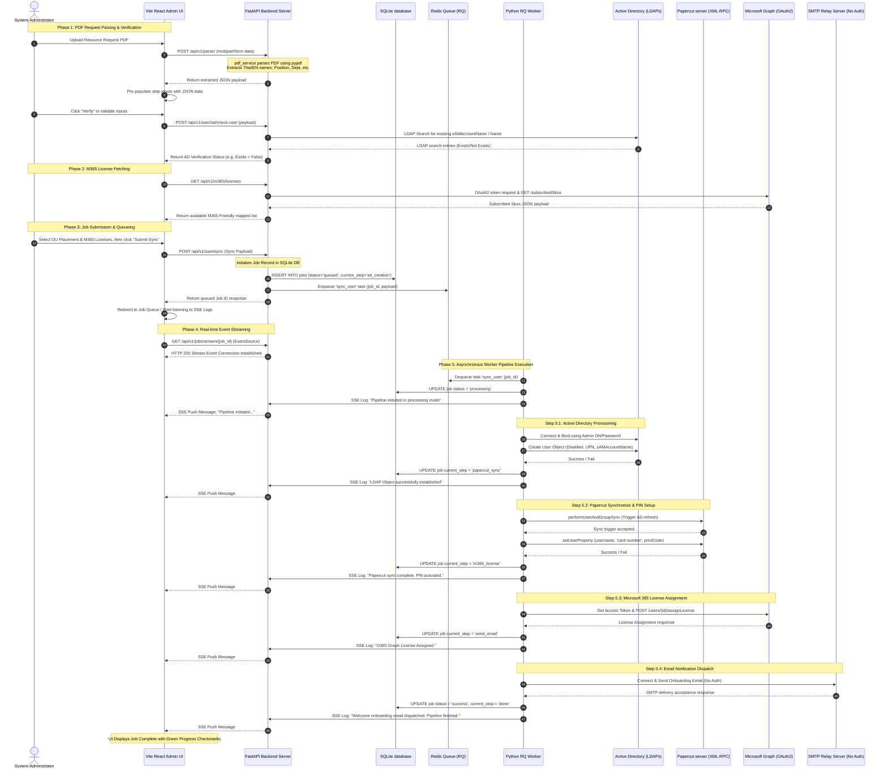

# IT Resource Provisioning System (3-Tier)

An automated enterprise resource provisioning engine designed to parse request PDFs, create Active Directory (AD) user accounts, synchronise print configurations on PaperCut, and assign Microsoft 365 licenses.

---

## 🏗️ System Architecture

The system utilizes a modern 3-Tier architecture comprising a Vite React frontend dashboard, a Python FastAPI gateway, and an asynchronous Redis Queue (RQ) background worker.



---

## 🛠️ Technology Stack & Libraries

### 1. Frontend Client
* **Framework**: React 19 (Single-page application)
* **Build Tool & Server**: Vite 6 (Fast local compiling and proxy routing)
* **Language**: TypeScript (Type-safe component design)
* **Styling**: Tailwind CSS v4 (Utility-first styling with modern CSS configuration)
* **Animations**: Motion (Clean transitions and micro-animations)
* **Icons**: Lucide React (Consistent visual UI indicators)

### 2. Backend REST API
* **Language**: Python 3.11+
* **Framework**: FastAPI (High-performance web API framework)
* **Web Server**: Uvicorn (Asynchronous ASGI server)
* **Real-time Engine**: sse-starlette (Server-Sent Events streaming server-side logs)
* **Database**: SQLite3 (Persistent tracking of provisioning jobs and logs)
* **Configuration**: python-dotenv (Environment configuration injector)

### 3. Service Integrations (Backend)
* **Active Directory Sync**: `ldap3` (Python LDAP client supporting LDAPS, failover configurations, and SSL)
* **PaperCut Integration**: `xmlrpc.client` (Built-in XML-RPC protocol for user property synchronization)
* **M365 License Provisioning**: `requests` (OAuth2 Client Credentials flow and Microsoft Graph API queries)
* **Email Notification**: `smtplib` / `email` (Built-in SMTP client sending notifications via unauthenticated SMTP relay)
* **PDF Extraction**: `pypdf` (Robust layout parsing of IT Resource request forms)

### 4. Background Job Queue
* **Broker**: Redis (High-speed message cache store)
* **Task Engine**: `rq` (Redis Queue for asynchronous job orchestration and worker execution)

---

## 🔄 User Provisioning Sequence Workflow

The sequential steps from parsing an administrative request PDF form to executing background synchronizations are detailed below.



---

## 🔌 External Connection & Protocol Specifications

Detailed protocols, standard port configuration, authentication flows, and software libraries utilized for external integrations:

| Target Infrastructure | Protocol / Interface | Default Port | Authentication / Security Method | Driver / Client Library |
| :--- | :--- | :--- | :--- | :--- |
| **Active Directory** | **LDAPs** (LDAP over TLS) | `636` (TCP) | Simple Bind (Admin DN / credentials) | `ldap3` (Python client) |
| **PaperCut printer server** | **XML-RPC** (over HTTP/S) | `9191` (HTTP) / `9192` (HTTPS) | Auth API Token (HTTP Header authorization) | `xmlrpc.client` (Python stdlib) |
| **Microsoft 365 / Entra ID** | **Microsoft Graph REST API** | `443` (HTTPS) | OAuth 2.0 Client Credentials flow (Client ID & Secret) | `requests` (OAuth/REST flow) |
| **Email Gateway / SMTP** | **SMTP** (Unauthenticated) | `25` (TCP) | No Authentication (Internal IP relay restriction) | `smtplib` / `email` (Python stdlib) |

---

## 📂 Project Directory Structure

```text
├── api/                      # FastAPI Backend Gateway
│   ├── core/                 # Configs, SQLite database initializer, exceptions
│   ├── endpoints/            # REST API routers (Jobs, User, M365, Parser)
│   ├── services/             # Business log adapters (AD LDAP, PaperCut, M365 Graph, PDF)
│   └── main.py               # Application startup script and static files mount
│
├── worker/                   # Background Task Engine
│   ├── tasks/                # Sync task pipelines (sync_user.py)
│   └── run.py                # RQ Worker boot daemon
│
├── frontend/                 # React Client Panel
│   ├── dist/                 # Production compiled bundles (Vite build output)
│   ├── src/                  # React Source Code
│   │   ├── components/       # UI panels (PDFProvision, JobQueue, ADExplorer, Dashboard)
│   │   ├── App.tsx           # App Router Layout
│   │   ├── main.tsx          # Client bundle initiator
│   │   └── types.ts          # Shared TypeScript type interfaces
│   ├── index.html            # Web Layout template
│   └── package.json          # Vite scripts and frontend dependencies
│
├── data/                     # SQLite database storage directory (jobs.db)
├── .env                      # Universal system configuration environment parameters
├── docker-compose.yml        # Multi-container microservices compose definition
└── README.md                 # System overview documentation
```

---

## 🚀 Getting Started

Ensure Docker and Docker Compose are installed on your target deployment environment.

### 1. Environment Configurations
Create a `.env` file at the root of the workspace matching the required settings:
```env
# Active Directory / LDAP Server
AD_HOSTS=10.10.10.250
AD_USER=aapico\itsupport
AD_PASSWORD=support
AD_BASE_DN=DC=aapico,DC=com

# PaperCut NG/MF API Settings
PAPERCUT_API_URL=http://10.10.10.235:9191/rpc/api/xmlrpc
PAPERCUT_API_KEY=your-auth-token-key

# SMTP Notification Settings (No Authentication)
SMTP_HOST=smtp.aapico.com
SMTP_PORT=25
SMTP_FROM=itsupport@aapico.com

# Redis Broker (Docker default)
REDIS_URL=redis://redis:6379/0
```

### 2. Startup Commands
Run the compose stack in detached mode:
```bash
# Build and run containers
docker compose up -d --build

# Stream logs of all services
docker compose logs -f
```

### 3. UI and Docs Access URLs
* **Admin dashboard panel**: [http://localhost:8000/](http://localhost:8000/)
* **Swagger API Documentation**: [http://localhost:8000/docs](http://localhost:8000/docs)
* **RQ Queue Dashboard**: [http://localhost:8000/rq](http://localhost:8000/rq)
