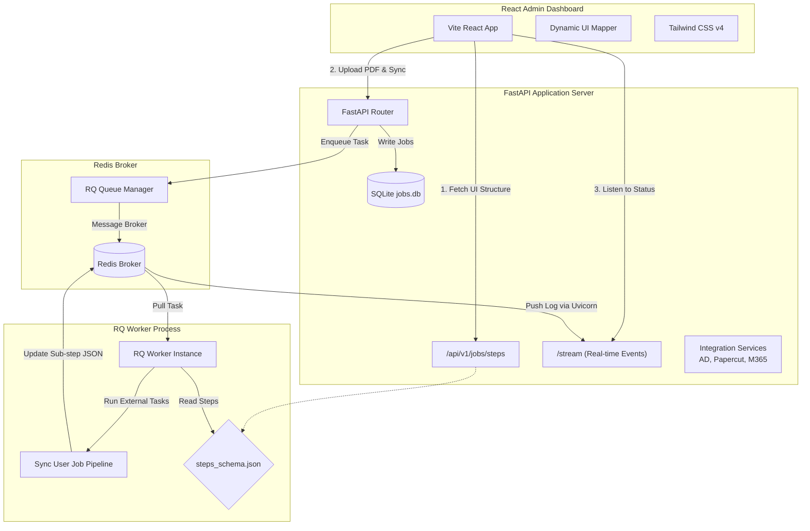
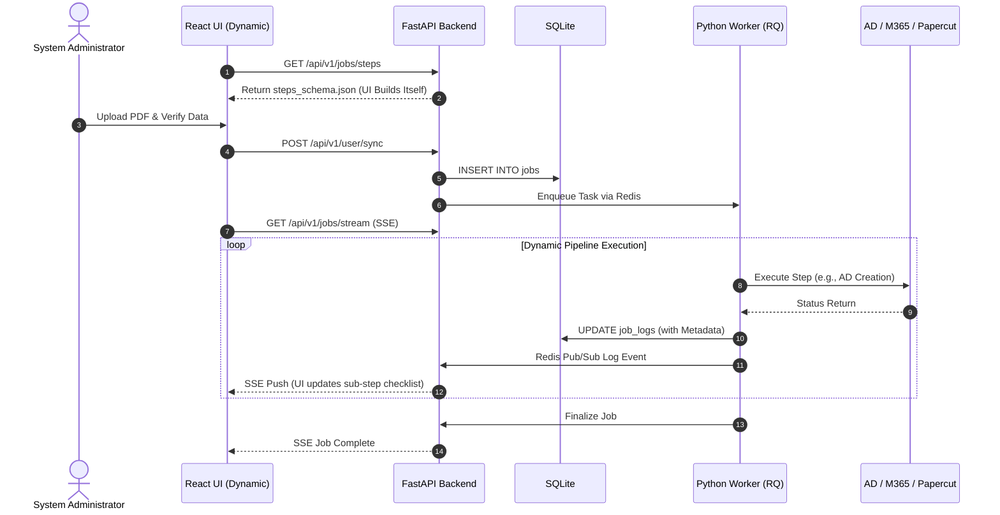

# IT Resource Provisioning System (3-Tier & AI-Ready)

An automated enterprise resource provisioning engine designed to parse request PDFs, create Active Directory (AD) user accounts, synchronise print configurations on PaperCut, and assign Microsoft 365 licenses. 

Recently upgraded to a **Zero-Change UI** and **AI-Friendly Architecture**, enabling dynamic step configuration without frontend recompilation.

---

## 🏗️ System Architecture & Data Flow

The system utilizes a modern 3-Tier architecture comprising a Vite React frontend dashboard, a Python FastAPI gateway, and an asynchronous Redis Queue (RQ) background worker. 

The frontend relies heavily on the `steps_schema.json` data contract, dynamically rendering the UI based on the backend's configuration.



---

## ⚡ Zero-Change UI & Dynamic Schema

This project employs a **Zero-Change Frontend** paradigm:
- **No Hardcoded Steps:** The React UI (`PDFProvisionTab.tsx` & `JobQueueTab.tsx`) uses `.map()` loops over the API schema.
- **`steps_schema.json`:** Located in the `/worker` directory, this is the **Single Source of Truth**. If you add a new step (e.g., `sap_sync`), you simply inject a JSON block here.
- **Real-time Metadata:** As the worker progresses, it embeds `metadata` (`sub_step`, `sub_step_status`) into the `job_logs`, which SSE pushes to the UI for live checkbox animations.

---

## 🤖 AI-Friendly Structure (Agent Context)

To facilitate autonomous AI development and prevent context hallucination, the repository implements strict contextual boundaries:
- **`.agentignore`**: Prevents AI models from scanning obsolete `temp/` scripts, saving token limits.
- **Contextual `ARCHITECTURE.md`**: Found at the root and inside every major tier directory (`api/`, `worker/`, `frontend/`). These files provide AI agents with immediate rules of engagement (e.g., SSE flow, explicit icon imports).

---

## 🛠️ Technology Stack & Libraries

### 1. Frontend Client
* **Framework**: React 19 (Single-page application)
* **Build Tool**: Vite 6 (With `manualChunks` vendor splitting for extreme optimization)
* **Styling**: Tailwind CSS v4 & Motion
* **State Management**: Zustand (Global cross-tab persistence)
* **Icons**: Lucide React (Using Explicit Mapping for Tree-Shaking)

### 2. Backend REST API
* **Framework**: FastAPI (Python 3.11+) with Uvicorn
* **Real-time Engine**: sse-starlette 
* **Database**: SQLite3 (Stores `metadata` JSON strings)

### 3. Background Job Queue & Worker
* **Broker**: Redis
* **Task Engine**: `rq` (Redis Queue)
* **Services**: `ldap3` (AD), `xmlrpc.client` (PaperCut), `requests` (M365 Graph), `smtplib` (Email)

---

## 🔄 User Provisioning Sequence Workflow



---

## 📂 Project Directory Structure

```text
├── .agentignore              # AI-optimization ignore rules
├── ARCHITECTURE.md           # Root rules for AI and Developers
├── api/                      
│   ├── ARCHITECTURE.md       # API boundary rules
│   ├── core/                 
│   ├── endpoints/            
│   └── services/             
│
├── worker/                   
│   ├── ARCHITECTURE.md       # Worker pipeline rules
│   ├── steps_schema.json     # 🌟 Single Source of Truth for pipeline
│   └── tasks/                
│
├── frontend/                 
│   ├── ARCHITECTURE.md       # React/Vite boundary rules
│   ├── src/                  
│   │   └── stores/           # Zustand global state stores
│   └── vite.config.ts        # Optimized with Vendor chunking
│
├── data/                     # SQLite storage (jobs.db)
├── temp/                     # Scratchpad for scripts (Git & AI Ignored)
├── docker-compose.yml        
└── README.md                 
```

---

## 🚀 Getting Started

Ensure Docker and Docker Compose are installed.

### 1. Environment Configurations
Create a `.env` file at the root:
```env
# Active Directory / LDAP Server
AD_HOSTS=10.10.10.250
AD_USER=aapico\itsupport
AD_PASSWORD=support
AD_BASE_DN=DC=aapico,DC=com

# PaperCut NG/MF API Settings
PAPERCUT_API_URL=http://10.10.10.235:9191/rpc/api/xmlrpc
PAPERCUT_API_KEY=your-auth-token-key

# SMTP Notification Settings
SMTP_HOST=smtp.aapico.com
SMTP_PORT=25
SMTP_FROM=itsupport@aapico.com

# Redis Broker
REDIS_URL=redis://redis:6379/0
```

### 2. Startup Commands
```bash
# Build and run containers
docker compose up -d --build

# Stream logs of all services
docker compose logs -f
```

### 3. Access URLs
* **Admin dashboard**: [http://localhost:8000/](http://localhost:8000/)
* **Swagger API**: [http://localhost:8000/docs](http://localhost:8000/docs)
* **RQ Dashboard**: [http://localhost:8000/rq](http://localhost:8000/rq)
