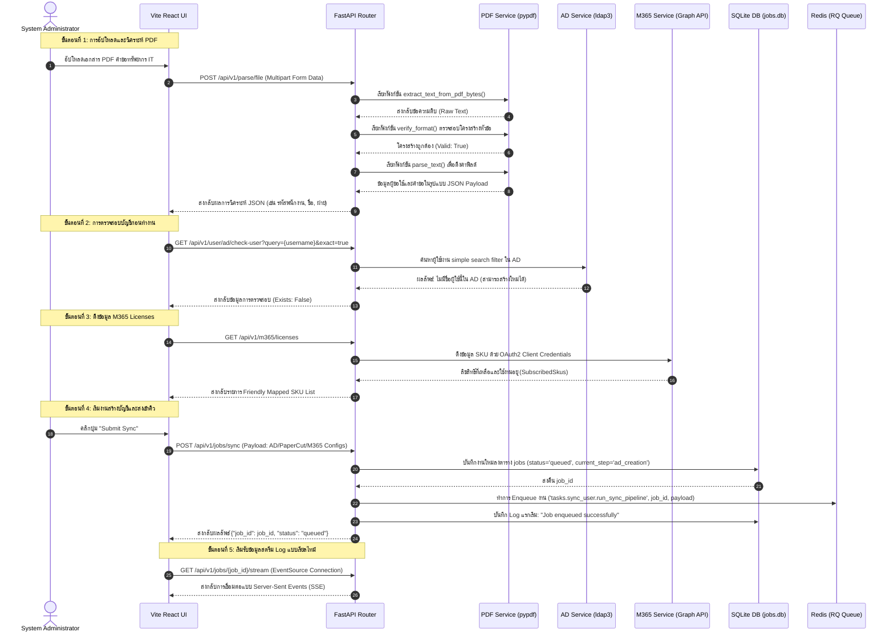

# 🌐 API Service: Workflow & Architecture Design

เอกสารนี้อธิบายสถาปัตยกรรม (Architecture) และขั้นตอนการทำงาน (Workflow) ของ **API Service (FastAPI Gateway)** ในโครงการระบบจัดการบัญชีผู้ใช้และการเชื่อมต่อรหัสเครื่องพิมพ์ (IT Resource Provisioning System) อย่างละเอียด

---

## 🏗️ 1. ภาพรวมสถาปัตยกรรม (Architecture Overview)

API Service ทำหน้าที่เป็น **Central Gateway (API Gateway)** ในรูปแบบ 3-Tier Architecture โดยใช้เฟรมเวิร์ก **FastAPI** ของ Python (3.11+) ทำงานร่วมกับเว็บเซิร์ฟเวอร์แบบ Asynchronous (**Uvicorn**) โดยทำหน้าที่ดังต่อไปนี้:
1. **RESTful API Endpoint Service**: รับคำสั่งจาก Vite React Admin Dashboard
2. **Request Validation & Processing**: รับไฟล์ PDF และวิเคราะห์โครงสร้างเพื่อแปลงเป็นข้อมูล JSON รวมถึงตรวจสอบสถานะผู้ใช้และกลุ่มความปลอดภัยใน Active Directory ก่อนเริ่มสร้างงาน
3. **Job Persistence & SQLite Engine**: บันทึกและควบคุมสถานะงาน (Job State) ลงในฐานข้อมูล SQLite
4. **Queue Orchestration & Redis Publisher**: ทำหน้าที่เป็น Publisher ในการจัดคิวงานส่งไปประมวลผลต่อที่ Background Worker ผ่าน Redis Queue (RQ)
5. **Real-time Server-Sent Events (SSE)**: ผลักดันข้อมูลและบันทึกเหตุการณ์ (Logs) จากฐานข้อมูล SQLite กลับไปยัง Admin UI แบบเรียลไทม์

### 📂 โครงสร้างภายใน API Service

```text
api/
├── core/                 # ส่วนประกอบสำคัญของระบบ
│   ├── config.py         # โหลดการตั้งค่าจากไฟล์ .env (Host, Port, AD, M365, Redis, DB)
│   ├── database.py       # จัดการการเชื่อมต่อ SQLite, อัปเดตงาน และเรียกดูบันทึก (Logs)
│   ├── exceptions.py     # ข้อยกเว้นแบบกำหนดเอง (Custom Exceptions เช่น PDFParsingError)
│   ├── redis_conn.py     # จัดการการเชื่อมต่อ Redis Queue (RQ) Connection
│   └── redis_mock.py     # ตัวจำลอง Redis ในกรณีที่ทำงานในโหมด Debug (SQLite Polling)
│
├── endpoints/            # Routing และ Endpoint แยกตามฟีเจอร์
│   ├── router.py         # ไฟล์ศูนย์รวม API Route ทั้งหมด
│   ├── parse.py          # Endpoint ตรวจสอบและดึงข้อมูลจาก PDF (/parse/file, /parse/url)
│   ├── user.py           # Endpoint ตรวจสอบ AD, กลุ่ม และการซิงค์แบบ Single-Thread (/user/ad/check-user, /user/sync)
│   ├── jobs.py           # Endpoint จัดการงาน คิวงาน การควบคุม Pause/Resume/Cancel และ SSE Stream (/jobs/sync, /jobs/{job_id}/stream)
│   ├── m365.py           # Endpoint จัดการลิขสิทธิ์ Microsoft 365 (/m365/licenses)
│   └── debug.py          # Endpoint ตรวจสอบและดึงข้อมูลเพื่อดีบั๊ก (/debug/inspect)
│
├── services/             # ส่วนเชื่อมต่อกับภายนอก (Adapters & External Services)
│   ├── pdf_service.py    # แยกวิเคราะห์และตรวจสอบโครงสร้าง PDF โดยใช้ pypdf
│   ├── ad_service.py     # จัดการ LDAP/LDAPS เชื่อมต่อกับ Active Directory (ตรวจสอบผู้ใช้, แสดงโครงสร้าง OU, ดึงรายละเอียดผู้ใช้)
│   ├── papercut_service.py # เชื่อมต่อกับเครื่องพิมพ์ PaperCut ผ่านโปรโตคอล XML-RPC
│   └── m365_service.py   # จัดการ Graph API ดึงรายการ License ข้อมูลผู้ใช้ และสิทธิ์การเข้าถึง
│
└── main.py               # จุดเริ่มต้นระบบ (Startup Script), จัดการ CORS และเมาต์ Static Files / Web UI
```

---

## 🔄 2. แผนผังการไหลของข้อมูลใน API (API Data Flow)

แผนภาพลำดับการทำงาน (Sequence Diagram) ตั้งแต่ขั้นตอนการสแกน PDF จนถึงการส่งต่อคิวและการเชื่อมต่อ SSE:



---

## ⚙️ 3. เจาะลึกการทำงานของ API Endpoints (Endpoint Deep-Dive)

### 3.1 การแยกและวิเคราะห์ PDF (`/api/v1/parse`)
* **`POST /parse/file`**: รับไฟล์ `.pdf` ผ่าน `UploadFile` ตรวจสอบนามสกุลไฟล์ ดึงข้อมูลตัวอักษรโดยใช้ `pypdf.PdfReader`
  - ตรวจสอบฟอร์แมตข้อมูลในเอกสารตามข้อกำหนดโครงสร้างหัวข้อไทย-อังกฤษที่ตั้งไว้ (เช่น *"ข้อมูลผู้ขอใช้ / Requester Information"*, *"รหัสพนักงาน / Employee ID"*)
  - ดึงข้อมูลด้วย Regular Expressions (RegEx) เพื่อรับฟิลด์ข้อมูลพนักงาน เช่น `Name-Surname (English)`, `Employee ID`, `Position`, `Department`, และรายการร้องขอสิทธิ์ ได้แก่ `User ID`, `Email`, `Internet`, `Telephone`, `Printer`
* **`POST /parse/url`**: เหมือนกับ `/parse/file` แต่จะรับพารามิเตอร์เป็น URL และใช้ `requests` ดาวน์โหลด PDF ลงมาในหน่วยความจำก่อนวิเคราะห์

### 3.2 ตรวจสอบโครงสร้างและบริการไดเรกทอรี (`/api/v1/user`)
* **`GET /user/ad/check-user`**: ตรวจสอบการซ้ำซ้อนของบัญชีผู้ใช้ใน Active Directory
  - `exact=true`: ค้นหา sAMAccountName ที่ตรงกันทุกประการ (สำหรับสร้างบัญชีใหม่)
  - `exact=false`: ค้นหาชื่อหน้า ค้นหาอีเมล หรือแสดงผลการจับคู่แบบกว้าง (Manager check)
* **`GET /user/ad/details`**: ดึงข้อมูลแอตทริบิวต์อย่างละเอียดของวัตถุ AD ตาม Distinguished Name (DN)
* **`GET /user/ad/tree`**: ดึงรายชื่อลูกระดับถัดไป (Children Nodes) ภายใต้ DN ที่ระบุสำหรับการแสดงผล AD Explorer Tree แบบไดนามิกบนหน้าต่าง UI แดชบอร์ด
* **`GET /user/ou/search`**: ค้นหา Organizational Unit (OU) ภายในโดเมนเพื่อใช้ระบุปลายทางการวางตำแหน่งผู้ใช้ใน AD
* **`GET /user/groups/search`**: ค้นหากลุ่มความปลอดภัย (Security Groups)

### 3.3 การจัดการลิขสิทธิ์ระบบคลาวด์ (`/api/v1/m365`)
* **`GET /m365/licenses`**: ขอ Token สิทธิ์โดยใช้ `M365_TENANT_ID`, `M365_CLIENT_ID` และ `M365_CLIENT_SECRET` เพื่อคุยกับ Microsoft Graph API Endpoint: `/subscribedSkus` เพื่อส่งคืนลิขสิทธิ์ทั้งหมดที่มีใน Tenant

### 3.4 การจัดการและควบคุมงานคิว (`/api/v1/jobs`)
* **`POST /jobs/sync`**: รับข้อมูลผู้ใช้และรายละเอียดการทำงานทั้งหมดเพื่อเปิดตั๋วประมวลผล (Job):
  1. สร้างรายการบันทึกใน SQLite `jobs` ด้วยรหัสเฉพาะ `job_id`
  2. ดันงานเข้าคิวของ Redis Queue (RQ) ภายใต้ชื่อคิวที่ใช้แชร์กันคือ `sync`
* **`PATCH /jobs/{job_id}`**: ควบคุมสถานะงานแบบ Dynamic Mid-Pipeline:
  - **`pause`**: ปรับสถานะใน SQLite เป็น `paused`
  - **`resume`**: ปรับสถานะใน SQLite กลับเป็น `processing`
  - **`cancel`**: ปรับสถานะใน SQLite เป็น `cancelled` ซึ่งกระบวนการฝั่ง Worker จะอ่านค่านี้ก่อนเริ่มทำงานขั้นถัดไปเพื่อยุติและลบประวัติงานอย่างปลอดภัย
* **`GET /jobs/{job_id}/stream`**: หน้าต่างเชื่อมต่อแบบเรียลไทม์ (Real-time SSE)

---

## 📡 4. สตรีมมิ่งเซิร์ฟเวอร์แบบเรียลไทม์ (SSE Stream Engine)

กลไกที่ทำให้แดชบอร์ดมีแถบความคืบหน้าแบบเรียลไทม์ทำงานโดยการสร้าง **Asynchronous Event Generator Loop** ภายใต้ไลบรารี `sse-starlette` ดังแผนผังนี้:

```text
+------------------+         HTTP EventSource Connection         +--------------------+
|  Vite React UI   | <========================================== |   FastAPI Router   |
+------------------+                                             +--------------------+
         ^                                                                 ||
         || (สตรีมเหตุการณ์เมื่อมีการอัปเดต เช่น step_update)                     || (สร้าง Event Generator)
         ||                                                                \/
+-------------------------------------------------------------------------------------+
|                      FastAPI Event Generator (Polling Loop)                         |
|                                                                                     |
|   1. Query SQLite jobs Table & logs Table ทุก 1 วินาที                                |
|   2. ตรวจสอบบันทึกใหม่: ID บันทึก > ID บันทึกล่าสุดที่ส่งไปแล้ว (last_log_id)         |
|   3. มีการอัปเดต Logs => yield { "event": "step_update", "data": ... }               |
|   4. ตรวจสอบความเปลี่ยนแปลงของสถานะหลัก (status) ในตาราง jobs                         |
|      - หากสถานะกลายเป็น 'success', 'failed', หรือ 'cancelled'                      |
|        => yield { "event": "job_complete" } และทำการหลุดลูป (Break Connection)      |
|      - หากสถานะกลายเป็น 'paused'                                                   |
|        => yield { "event": "job_paused" } เพื่อแจ้งเตือนหน้าบ้าน                     |
+-------------------------------------------------------------------------------------+
```

---

## 🛠️ 5. รายละเอียดโปรโตคอลและการจัดการฐานข้อมูล (Datastore & Protocols)

### 5.1 โครงสร้างฐานข้อมูล SQLite (`jobs.db`)

ตารางข้อมูลหลักที่ API Service จัดการ:
1. **`jobs`**: บันทึกข้อมูลงานทั้งหมดและสถานะปัจจุบัน
   - `id` (TEXT, PRIMARY KEY): รหัสอ้างอิงงาน
   - `status` (TEXT): `queued`, `processing`, `paused`, `success`, `failed`, `cancelled`
   - `current_step` (TEXT): ขั้นตอนที่กำลังทำอยู่ เช่น `ad_creation`, `papercut_sync`, `m365_license`, `send_email`, `done`
   - `payload` (TEXT): ข้อมูล Payload ดั้งเดิมในรูปแบบ JSON String
   - `result` (TEXT): ผลลัพธ์สุดท้ายเมื่อทำงานเสร็จสมบูรณ์
   - `error` (TEXT): รายละเอียดข้อผิดพลาดถ้างานล้มเหลว
   - `created_at` (TIMESTAMP)
   - `updated_at` (TIMESTAMP)
2. **`logs`**: เก็บบันทึกความคืบหน้าของขั้นตอนย่อยเพื่อส่งผ่าน SSE
   - `id` (INTEGER, PRIMARY KEY AUTOINCREMENT)
   - `job_id` (TEXT, FOREIGN KEY)
   - `step` (TEXT)
   - `status` (TEXT): `running`, `success`, `failed`, `paused`, `skipped`
   - `message` (TEXT)
   - `created_at` (TIMESTAMP)

### 5.2 ไลบรารีและการตั้งค่าโปรโตคอลการเชื่อมต่อ

| บริการปลายทาง | โปรโตคอล / รูปแบบการติดต่อ | พอร์ต | ไลบรารี/โมดูลหลัก |
| :--- | :--- | :--- | :--- |
| **Active Directory** | **LDAPs** (LDAP over TLS) | `636` | `ldap3` |
| **PaperCut Server** | **XML-RPC** (over HTTP/HTTPS) | `9191` / `9192` | `xmlrpc.client` |
| **Microsoft 365** | **Graph Rest API** (HTTPS) | `443` | `requests` (OAuth 2.0 Credentials Flow) |
| **Redis Broker** | **Redis Connection Protocol** | `6379` | `redis` / `rq` |
| **SQLite DB** | **Local File Access** | N/A | `sqlite3` (Python Standard Library) |
